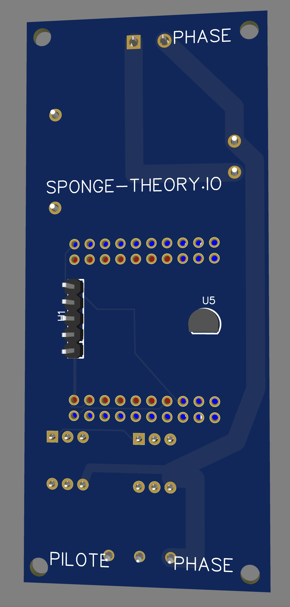

# Smart Heater with presence detection and "Fil Pilote"
Create an ESP32 Heater controller for HomeKit

# Build

Install VSCode and PlateformIO, build as usual.

# Building this 

* ESP32 Wemos 32 Mini

* All the BOM is in the PCB folder, including Gerber and pick and place file

* This device includes a Dallas thermistor and a radar detectot (LD2410C)

# Shematics & PCB

Beware : this device is plugged to 220v !

# Homekit configuration

* Use build and monitor from PlateformIO menu, then use the W command in the monitor to setup you wifi credential.

* Then, use this barecode to add the accessory into you homekit

